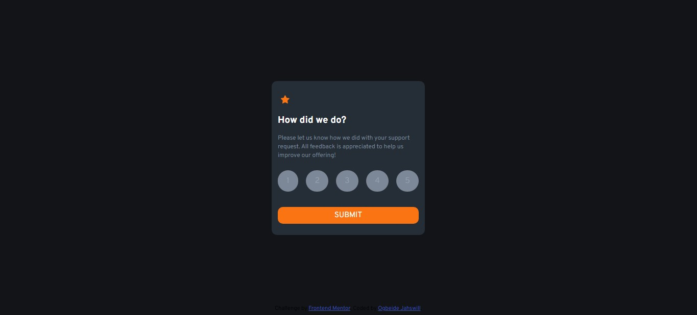

# Frontend Mentor - Order summary card solution

This is a solution to the Interactive rating component challenge on Frontend Mentor. Frontend Mentor challenges help you improve your coding skills by building realistic projects.

## Table of contents

- [Overview](#overview)
  - [The challenge](#the-challenge)
  - [Screenshot](#screenshot)
  - [Links](#links)
- [My process](#my-process)
  - [Built with](#built-with)
- [Author](#author)

## Overview

### The challenge

Users should be able to:

- See hover states for interactive elements

### Screenshot

### Links

- Solution URL: [frontend-mentors-interactive-rating](https://frontend-mentors-interactive-rating.netlify.app/)
- Live Site URL: [frontend-mentors-interactive-rating](https://frontend-mentors-interactive-rating.netlify.app/)

## My process

### Built with

- Semantic HTML5 markup
- CSS custom properties
- Sass
- JavaScript

## Author

- GitHub - [Ogbeide Jahswill](https://github.com/JhayJahswiil)
- Frontend Mentor - [@JhayJahswiil](https://www.frontendmentor.io/profile/JhayJahswiil)
- Twitter - [@JhayJahswill](https://www.twitter.com/JhayJahswill)

